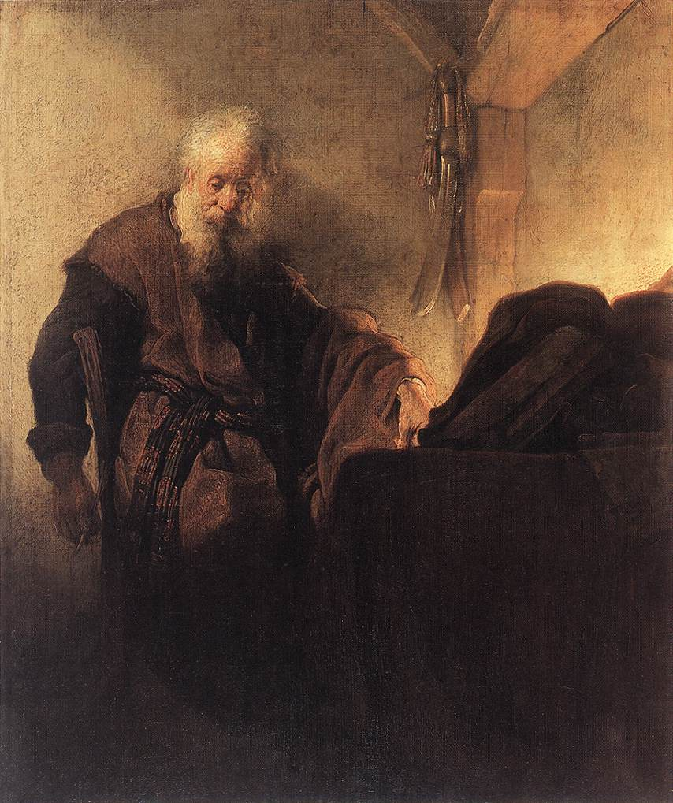

#Chiaroscuro

Chiaroscuro is a painting style that emerged from the late Renaissance, utilizing dramatic
contrasts of light and dark to embolden the subject and accentuate the emotional
and psychological components of the painting. Both quiet meditation (such as
this painting of St. Paul at his Writing Desk, by Rembrandt) and tense confrontation
become emboldened by the interplay between bright, light colors and the deep darkness
of the background. Chiaroscuro was pioneered by artists like Boglione and Caravaggio, and
perfected by Rembrandt by the early seventeenth century.
